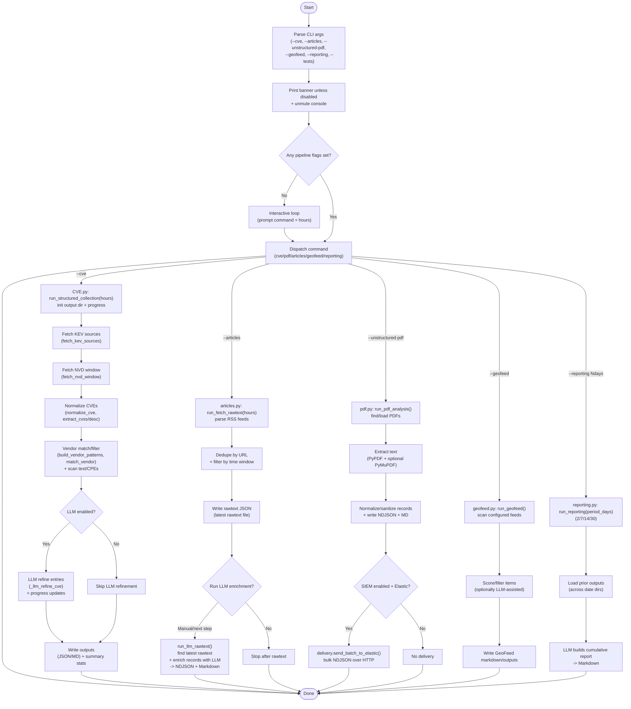
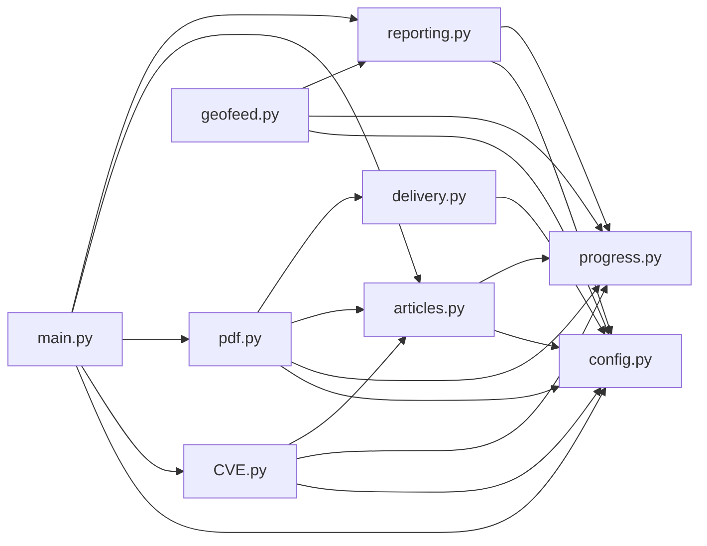

# Collector diagrams

---

## Architecture overview

```mermaid
flowchart TB
  %% ===== Entry / Orchestration =====
  subgraph CLI["Entry & Orchestration"]
    MAIN["main.py\nCLI + interactive menu\nroutes to pipelines"]
  end

  %% ===== Shared =====
  subgraph SHARED["Shared Runtime"]
    CONFIG["config.py\nENV config, paths, logger\nfeature flags (LLM/SIEM/etc)"]
    PROG["progress.py\nprogress_bar / live animation"]
  end

  %% ===== Pipelines =====
  subgraph PIPE["Collection Pipelines"]
    CVE["CVE.py\nStructured CVE/KEV collector\n+ optional LLM refinement"]
    ART["articles.py\nRSS/article fetch -> rawtext\n+ optional LLM enrichment"]
    PDF["pdf.py\nPDF ingest -> text extract\n+ optional SIEM delivery"]
    GEO["geofeed.py\nGeoFeed local-news scanner\n(optional module presence)"]
    REP["reporting.py\nCumulative multi-day reporting\n(LLM-based summarization)"]
  end

  %% ===== External Sources =====
  subgraph EXT["External Inputs / Services"]
    NVD["NVD CVE API\n(services.nvd.nist.gov)"]
    KEV["CISA KEV source(s)\n(fetch_kev_sources)"]
    RSS["RSS Feeds\n(articles/geofeed)"]
    PDFs["Local/Provided PDF files"]
    OLL["Local LLM via Ollama\n(LLM_MODEL / OLLAMA_HOST)"]
    ELK["Elastic SIEM Endpoint\n(ndjson bulk)"]
  end

  %% ===== Storage/Outputs =====
  subgraph OUT["Outputs"]
    RES["results/\nper-run artifacts"]
    RAW["Rawtext JSON\n(discovered/deduped entries)"]
    NDJ["NDJSON\n(enriched records)"]
    MD["Markdown reports\n(per pipeline + cumulative)"]
  end

  %% Orchestration -> pipelines
  MAIN --> CVE
  MAIN --> ART
  MAIN --> PDF
  MAIN --> GEO
  MAIN --> REP

  %% Shared dependencies
  MAIN --> CONFIG
  CVE --> CONFIG
  ART --> CONFIG
  PDF --> CONFIG
  GEO --> CONFIG
  REP --> CONFIG

  CVE --> PROG
  ART --> PROG
  PDF --> PROG
  GEO --> PROG
  REP --> PROG

  %% External inputs
  CVE --> KEV
  CVE --> NVD
  ART --> RSS
  GEO --> RSS
  PDF --> PDFs

  %% LLM enrichment (feature-flagged)
  CVE -. "LLM_ENABLED" .-> OLL
  ART -. "LLM_ENABLED" .-> OLL
  GEO -. "LLM-enabled analysis" .-> OLL
  REP -. "LLM-based summarization" .-> OLL
  PDF -. "LLM-ish processing (if configured)" .-> OLL

  %% Outputs
  CVE --> RES
  ART --> RAW
  ART --> NDJ
  ART --> MD
  PDF --> NDJ
  PDF --> MD
  GEO --> MD
  REP --> MD

  RES --> MD
  RES --> NDJ

  %% Delivery (only where implemented)
  PDF -->|"SIEM_ENABLED & SIEM_TYPE=elastic"| ELK

```

---

## Runtime process flow

```mermaid
flowchart TD
  START([Start]) --> ARGS["Parse CLI args\n(--cve, --articles, --unstructured-pdf,\n --geofeed, --reporting, --tests)"]
  ARGS --> BANNER["Print banner unless disabled\n+ unmute console"]
  BANNER --> DEC{Any pipeline flags set?}

  DEC -- "No" --> MENU["Interactive loop\n(prompt command + hours)"]
  MENU --> ROUTE["Dispatch command\n(cve/pdf/articles/geofeed/reporting)"]

  DEC -- "Yes" --> ROUTE

  %% ===== Structured CVE pipeline =====
  ROUTE -->|--cve| CVE1["CVE.py: run_structured_collection(hours)\ninit output dir + progress"]
  CVE1 --> CVE2["Fetch KEV sources\n(fetch_kev_sources)"]
  CVE2 --> CVE3["Fetch NVD window\n(fetch_nvd_window)"]
  CVE3 --> CVE4["Normalize CVEs\n(normalize_cve, extract_cvss/desc)"]
  CVE4 --> CVE5["Vendor match/filter\n(build_vendor_patterns, match_vendor)\n+ scan text/CPEs"]
  CVE5 --> CVE6{LLM enabled?}
  CVE6 -- Yes --> CVE7["LLM refine entries\n(_llm_refine_cve)\n+ progress updates"]
  CVE6 -- No --> CVE8["Skip LLM refinement"]
  CVE7 --> CVE9["Write outputs\n(JSON/MD) + summary stats"]
  CVE8 --> CVE9

  %% ===== Articles/RSS pipeline =====
  ROUTE -->|--articles| A1["articles.py: run_fetch_rawtext(hours)\nparse RSS feeds"]
  A1 --> A2["Dedupe by URL\n+ filter by time window"]
  A2 --> A3["Write rawtext JSON\n(latest rawtext file)"]
  A3 --> A4{Run LLM enrichment?}
  A4 -- "Manual/next step" --> A5["run_llm_rawtext()\nfind latest rawtext\n+ enrich records with LLM\n-> NDJSON + Markdown"]
  A4 -- "No" --> A6["Stop after rawtext"]

  %% ===== PDF pipeline =====
  ROUTE -->|--unstructured-pdf| P1["pdf.py: run_pdf_analysis()\nfind/load PDFs"]
  P1 --> P2["Extract text\n(PyPDF + optional PyMuPDF)"]
  P2 --> P3["Normalize/sanitize records\n+ write NDJSON + MD"]
  P3 --> P4{SIEM enabled + Elastic?}
  P4 -- Yes --> P5["delivery.send_batch_to_elastic()\nbulk NDJSON over HTTP"]
  P4 -- No --> P6["No delivery"]

  %% ===== GeoFeed =====
  ROUTE -->|--geofeed| G1["geofeed.py: run_geofeed()\nscan configured feeds"]
  G1 --> G2["Score/filter items\n(optionally LLM-assisted)"]
  G2 --> G3["Write GeoFeed markdown/outputs"]

  %% ===== Reporting =====
  ROUTE -->|--reporting Ndays| R1["reporting.py: run_reporting(period_days)\n(2/7/14/30)"]
  R1 --> R2["Load prior outputs\n(across date dirs)"]
  R2 --> R3["LLM builds cumulative report\n-> Markdown"]

  ROUTE --> END([Done])
  CVE9 --> END
  A5 --> END
  A6 --> END
  P5 --> END
  P6 --> END
  G3 --> END
  R3 --> END

```

---

## Module dependency graph

```mermaid
flowchart LR
  MAIN["main.py"] --> CONFIG["config.py"]
  MAIN --> CVE["CVE.py"]
  MAIN --> PDF["pdf.py"]
  MAIN --> ART["articles.py"]
  MAIN --> REP["reporting.py"]

  CVE --> CONFIG
  CVE --> PROG["progress.py"]
  CVE --> ART

  ART --> CONFIG
  ART --> PROG

  PDF --> CONFIG
  PDF --> PROG
  PDF --> ART
  PDF --> DELIV["delivery.py"]

  DELIV --> CONFIG

  GEO["geofeed.py"] --> CONFIG
  GEO --> PROG
  GEO --> REP

  REP --> CONFIG
  REP --> PROG

```